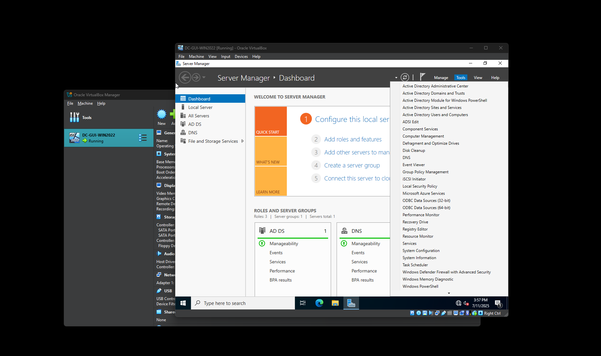
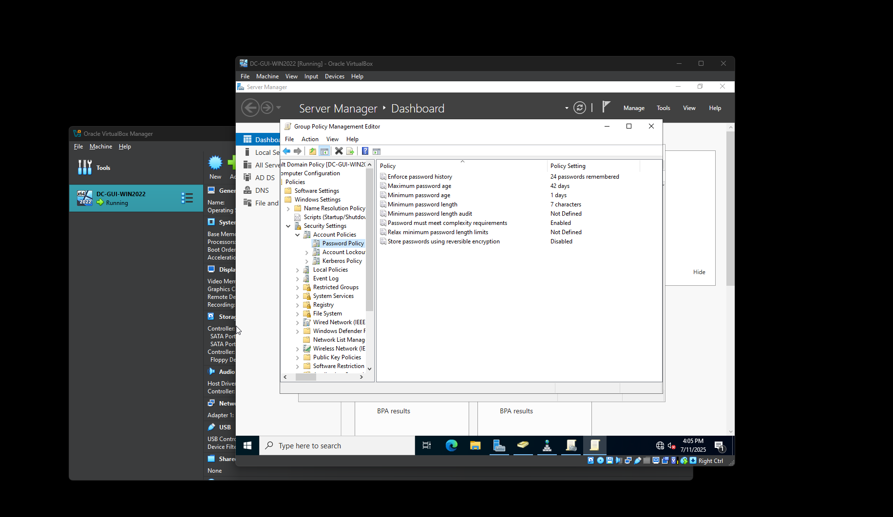

# Security+ Lab Project: Setting Up Active Directory & Password Policies

This project documents the process of setting up a Windows Server 2022 virtual machine as a domain controller, configuring Active Directory Domain Services (AD DS), and creating custom password policies using Group Policy Management.

---

### 🖼️ Screenshot 01 – Renaming the Computer

In this step, I renamed the default computer name (`DC-WINSERVER2022`) to `DC-CYBERLAB` as part of the post-installation configuration.

Renaming the server to something meaningful helps with identification — especially when managing multiple servers in a real-world domain environment. Using a prefix like `DC-` (Domain Controller) makes it clear that this server will be responsible for managing domain authentication and directory services.

📍 **Command-line Setup Tool:** This is part of the initial Windows Server Setup screen shown after installation, before the full GUI environment loads.

---

### 🖼️ Screenshot 02 – Initial Server Setup via SConfig

After the Windows Server 2022 installation completed, I was brought to the **SConfig** (Server Configuration) menu. This command-line utility allows you to configure key server settings before launching the desktop GUI.

From this screen, I verified:
- The computer name change (now shows as `DC-CYBERLAB`)
- That the system is in **Workgroup mode** (default before domain promotion)
- Remote management was enabled

🔧 Other available configuration options from this screen include:
- Setting a static IP address
- Enabling Remote Desktop
- Installing updates
- Joining a domain or changing to a new workgroup
- Accessing PowerShell to install additional features

This menu simulates how **real-world system administrators** often configure headless servers, especially in secure or remote environments where GUI access isn’t always available.

📝 **Tip:** You can type the number for any menu item to access its configuration screen. For example, typing `8` accesses **Network Settings**.

---

### 🖼️ Screenshot 03 – Viewing Network Adapter in SConfig

After selecting option `8` from the SConfig menu, I was shown a list of available network adapters. This screen confirms which network interfaces are installed and currently active.

In this case:
- **Index #**: 1
- **IP Address**: 10.0.2.15 (assigned via DHCP)
- **Adapter**: Intel(R) PRO/1000 MT Desktop Adapter (default VirtualBox NIC)

📌 This screen is important because it allows you to:
- Select which adapter to configure
- Set a **static IP** (important for domain controllers)
- Configure **DNS** settings

🔧 To proceed, you type the **index number** for the adapter you want to configure — in my case, `1`.

---

### 🖼️ Screenshot 04 – Set Static IP and DNS Server (Before Promotion)

Once I selected my network adapter (`Index 1`), I was given the following options:

1. Set network adapter address  
2. Set DNS servers  
3. Clear DNS server settings  

✅ As a best practice for domain controllers and any critical infrastructure, **a static IP address is required**. DHCP-assigned addresses can change over time, which would break name resolution and trust relationships in the domain.

---

#### Why this matters in the real world:
- **Static IP** ensures stability for domain services, DNS, and GPO distribution  
- Helps other devices on the network consistently reach this server  
- Prepares the server for **Active Directory promotion**

🛠️ **What I did next:**
- Selected option `1` to begin configuring the static IP, subnet mask, and default gateway.  
- I then continued with option `2` to specify a preferred DNS server.

---

### 🖼️ Screenshot 05 – Enabling Remote Desktop Access

Next, I selected option `7` from the SConfig main menu to configure **Remote Desktop**.

This feature allows administrators to manage the server remotely using a Remote Desktop Protocol (RDP) client — especially helpful in enterprise environments or cloud-based deployments where direct console access is limited.

I was prompted with the following choices:

1. **Allow only clients using Network Level Authentication (NLA)** – more secure  
2. **Allow any version of Remote Desktop** – less secure, allows legacy connections  

✅ I selected **Option 1** to enforce **Network Level Authentication (NLA)** for improved security. This ensures that only authenticated users from trusted machines can initiate remote sessions.

---

#### 🛡️ Why this matters in the real world:
- **Remote Desktop (RDP)** is essential for remote server management — especially in hybrid or multi-site IT setups  
- Enabling NLA reduces the risk of brute-force RDP attacks  
- This setting is often required when managing servers via **Azure**, **Hyper-V**, or **Remote Management Tools** like RSAT or Windows Admin Center

---

### 🖼️ Screenshot 06 – Selecting Allowed Remote Desktop Clients

After choosing to enable Remote Desktop, I was prompted to choose which types of client connections should be allowed:

1. **Allow only clients running Remote Desktop with Network Level Authentication (more secure)**  
2. **Allow clients running any version of Remote Desktop (less secure)**  

✅ I selected **Option 1** – this enforces **Network Level Authentication (NLA)**.

---

### 🖼️ Screenshot 07 – Attempting to Launch GUI with `explorer.exe`

At this point, I attempted to launch the Windows desktop environment using the `explorer` command from the PowerShell/Command Prompt, but received the following error:

> "The term 'explorer' is not recognized as the name of a cmdlet, function, script file, or operable program..."

This happened because I accidentally installed **Windows Server 2022 without Desktop Experience (Server Core)**. In this configuration, the GUI components are not installed, and the server must be managed entirely from PowerShell or remotely.

---

### 🔁 What I Did Next:

I reinstalled the OS, this time choosing:
- **Windows Server 2022 Standard Evaluation – Desktop Experience**

This enabled the full GUI, including Server Manager, Active Directory tools, and graphical Group Policy editors.

---

### 💡 Why This Is Valuable:

- Many production servers **run Server Core** for performance and security reasons  
- Learning to identify and recover from setup mistakes is a key IT skill  
- This shows the ability to **troubleshoot**, **adapt**, and **correct configuration issues** on your own

📝 I included this step in the project to demonstrate the learning process and the importance of selecting the correct edition during setup.

---

### 🖼️ Screenshot 08 – First Login into the Windows Server 2022 GUI

After reinstalling the operating system and choosing the **Desktop Experience** edition, I successfully booted into the full graphical user interface (GUI) of Windows Server 2022.

The screen shows the default landing page: **Server Manager – Dashboard**, which is where most core configuration tasks begin.

---

### 🧠 Why This Matters:

- Many Windows Server roles (like **Active Directory**, **DNS**, **DHCP**, and **GPO**) are most easily managed through the GUI  
- While headless (CLI-only) setup is powerful, the GUI is commonly used in real-world small/medium-sized business environments  
- This environment mirrors what a help desk or junior sysadmin would see when logging into a real production server

🔧 From here, I would continue the setup by:
- Adding Active Directory Domain Services (AD DS)  
- Promoting the server to a domain controller  
- Managing password policies using Group Policy Management

---

📝 Pro Tip:
If you're running a server in a VM and performance is low, disable **Server Manager’s auto-start** on login using the “Manage” menu → **Server Manager Properties** → Check “Do not start Server Manager automatically at logon”.

---

### 🖼️ Screenshot 09 – Selecting Role-Based or Feature-Based Installation

In Server Manager, I clicked **"Add roles and features"** to begin setting up Active Directory Domain Services (AD DS). This opened the **Add Roles and Features Wizard**.

On this screen, I selected:
> ✅ **Role-based or feature-based installation**

This is the most common option and is used to install server roles (like AD DS, DNS, DHCP, etc.) and features on a **single, physical or virtual server**.

---

### 🧠 Why This Step Matters:

- This is the standard method to **enable server roles** on Windows Server  
- It's a common real-world task for help desk and system administrators  
- Knowing how to use the wizard properly is a fundamental server management skill

🔐 For this lab, we are preparing the server to become a **Domain Controller**, which will allow centralized user, computer, and security policy management — just like in corporate networks.

---

📝 **Next Steps in the Wizard:**
- Select the local server as the installation target  
- Choose the role: **Active Directory Domain Services**  
- Accept dependencies and proceed through configuration

---

### 🖼️ Screenshot 10 – Selecting the Active Directory Domain Services (AD DS) Role

On the **Select server roles** screen, I hovered over and selected:
> ✅ **Active Directory Domain Services**

This is the core role that turns a Windows Server into a **domain controller** — the heart of a Windows-based enterprise network.

After selecting the role, the wizard automatically prompted me to install **dependent features** (like management tools and MMC snap-ins), which I accepted.

---

### 🧠 Why This Role Matters:

- **AD DS** provides centralized management of users, computers, groups, and security policies across the network  
- Enables the creation of a domain (`yourname.local`) where devices can **join**, **authenticate**, and be managed  
- Used daily in almost every mid-to-large IT organization for **identity and access control**

---

🔐 Real-World Use Case:
> A company with 100+ employees would use a domain controller to manage:  
> - Employee logins  
> - Password complexity enforcement  
> - Software deployment via GPO  
> - Security auditing

🛠️ After this step, I continued through the wizard to confirm features, and eventually promoted the server to a domain controller.

---

### 🖼️ Screenshot 11 – Adding Required Features for AD DS

After selecting the **Active Directory Domain Services (AD DS)** role, the wizard prompted me with a pop-up to install required supporting features.

I clicked:
> ✅ **Add Features**

This ensures that tools like **AD DS Management Console**, **PowerShell modules**, and **Graphical MMC Snap-ins** are installed — all of which are necessary for managing Active Directory users, domains, and policies.

---

### 🧠 Why This Step Is Important:

- These features are **not optional** if you want to actually manage the domain after installation  
- Includes tools like:  
  - **Active Directory Users and Computers (ADUC)**  
  - **Active Directory Administrative Center (ADAC)**  
  - **Group Policy Management Console (GPMC)**  
- Allows both **local and remote** administration of the domain

---

🛠️ Pro Tip for New Admins:
In enterprise environments, you may need to install these tools **remotely** using PowerShell with `Add-WindowsFeature`, or deploy them through **Windows Admin Center**. Knowing how to install and recognize dependencies shows you're thinking like a real sysadmin.

---

### 🖼️ Screenshot 12 – Confirming Role and Feature Installation Selections

At this point, I reviewed all of my configuration choices before starting the installation process. This screen summarizes:

- **Installation type:** Role-based  
- **Target server:** DC-CYBERLAB  
- **Role to install:** Active Directory Domain Services (AD DS)  
- **Dependent features:** Group Policy Management, Remote Server Administration Tools (RSAT), and AD DS snap-ins

After confirming that all settings were correct, I clicked:
> ✅ **Install**

---

### 🧠 Why This Step Matters:

- It teaches **change control discipline** — the habit of verifying everything before making system changes  
- Mistakes (like forgetting a needed role or installing on the wrong server) are **caught here before damage is done**  
- In production, changes like this are logged, reviewed, and often require peer approval — showing this step reflects a real-world mindset

---

📝 Pro Tip for Beginners:
If you're deploying in a real environment:  
- Take a screenshot of this confirmation page before clicking install (for documentation or rollback logs)  
- Optionally check the box for **“Restart the destination server automatically if required”** if you’ve confirmed with your team or documentation

---

### 🖼️ Screenshot 13 – Promoting the Server to a Domain Controller

After installing the Active Directory Domain Services (AD DS) role, a yellow notification banner appeared in **Server Manager** with the message:

> “Additional steps are required to make this machine a domain controller.”

I clicked:
> ✅ **Promote this server to a domain controller**

This launched the **Active Directory Domain Services Configuration Wizard**, where I will:
- Create a **new forest and domain** (since this is my first domain controller)  
- Set the **domain name**  
- Configure the **Directory Services Restore Mode (DSRM)** password

---

### 🧠 Why This Step Matters:

- Promoting a server to a domain controller creates the **first domain in a new forest**, which is the top-level structure of Active Directory  
- This step **installs and configures the AD database (NTDS)**, **creates SYSVOL**, and sets up **replication** (if more domain controllers are added later)  
- This is a **core responsibility** for help desk, sysadmin, and even cybersecurity roles — understanding how identity infrastructure is built

---

🔐 Real-World Application:
> In a production environment, this task would usually be performed during:  
> - New office/domain setup  
> - Disaster recovery (replacing a failed DC)  
> - Lab environments for cybersecurity testing or compliance auditing

---

### 🖼️ Screenshot 14 – Creating a New Forest in Active Directory

In the **Active Directory Domain Services Configuration Wizard**, I selected:

> ✅ **Add a new forest**

This option is used when you are creating the **very first domain** in a new network environment. In my case, this is for a standalone lab setup, but the same process applies in real production environments.

I then entered my root domain name:
> 🔤 **cyberlab.local**

This will become the top-level domain for all users, computers, and group policies in my Active Directory environment.

---

### 🧠 Why This Step Matters:

- A **forest** is the top-level container in Active Directory — it can hold one or more **domains**  
- Creating a new forest means you're building a **completely new identity infrastructure** from scratch  
- Every device or user that joins this domain will use **cyberlab.local** as their domain suffix (e.g., `user@cyberlab.local`)

---

💡 Real-World Example:
> A company like “Acme Inc.” may create a forest with the domain **acme.local** or **corp.acme.com** during its initial IT setup. Domain controllers, DNS, and Group Policy will all be based around this root domain name.

📝 Pro Tip:
- Domain names for internal use often end in `.local` or use a subdomain like `corp.company.com`  
- Avoid using actual public domains like `company.com` unless you're integrating with public-facing systems
  
---

### 🖼️ Screenshot 15 – Reviewing Deployment Options Before Promotion

Before promoting the server to a domain controller, I reviewed the deployment options including:

- Forest and domain functional levels (set to Windows Server 2022 for latest features)  
- Whether to install DNS Server (checked)  
- Global Catalog (enabled by default)  
- Read-only domain controller (not selected since this is the first DC)  
- DSRM password configuration

---

### 🧠 Why This Step Matters:

- Selecting the correct forest and domain functional levels ensures compatibility and feature availability  
- Installing DNS on the domain controller is necessary since Active Directory depends heavily on DNS  
- Setting the DSRM password is critical for recovery scenarios when Active Directory repair is needed

---

### 🖼️ Screenshot 16 – Prerequisites Check for Domain Controller Promotion

The wizard runs a **prerequisites check** to validate:

- Network connectivity  
- DNS settings and delegation  
- Required services and roles installed  
- No existing conflicting domain controllers or domain names

Upon passing all checks, the promotion process can safely proceed.

---

### 🧠 Why This Step Matters:

- Prerequisites check prevents misconfiguration and potential domain-wide issues  
- Highlights any warnings or errors before changes are made to Active Directory  
- Emulates real-world IT change control best practices where validations are mandatory

---

### 🖼️ Screenshot 17 – Server Restart After Domain Controller Promotion

After the promotion completed successfully, the server automatically restarted to apply changes.

This reboot finalizes:

- Domain controller services activation  
- SYSVOL and Netlogon shares creation  
- DNS server startup

---

### 🧠 Why This Step Matters:

- Domain controllers require a reboot to fully initialize and register services  
- Ensures all changes are properly applied and persistent  
- After reboot, the server joins the new domain and starts servicing authentication requests

---

### 🖼️ Screenshot 18 – Accessing DNS Manager Post-Promotion

In Server Manager, I opened **DNS Manager** to view **Forward Lookup Zones**.

The zone for my new domain (`cyberlab.local`) was automatically created during promotion.

---

### 🧠 Why This Step Matters:

- DNS zones are essential for domain name resolution within Active Directory  
- Ensures clients can find domain controllers and other services via DNS  
- Verifying the zone existence confirms proper AD DNS integration

---

### 🖼️ Screenshot 19 – Navigating to Group Policy Management Editor

I launched **Group Policy Management Editor** and navigated to:

`cyberlab.local` → **Default Domain Policy** →  
`Computer Configuration` → `Policies` → `Windows Settings` → `Security Settings` → `Account Policies` → `Password Policy`

Here, I reviewed the current password settings.

---

### 🧠 Why This Step Matters:

- Group Policy manages centralized configuration for all domain-joined computers and users  
- Password policies enforce security standards to protect user accounts  
- Editing these policies demonstrates control over enterprise security settings

---

### 🖼️ Screenshot 20 – Creating a New Group Policy Object (GPO)

Within **Group Policy Management Console**, I right-clicked **Group Policy Objects** and selected **New** to create a custom GPO.

I named the new GPO:
> 🔤 **Custom Password Policy**

---

### 🧠 Why This Step Matters:

- Creating a separate GPO allows targeted and controlled policy changes  
- Keeps default domain policies intact for fallback  
- Enables granular security customization per organizational requirements

---

### 🖼️ Screenshot 21 – Confirming Link Enabled on Default Domain Policy

Back in Group Policy Management, I confirmed that the **Default Domain Policy** is linked and enabled for `cyberlab.local`.

---

### 🧠 Why This Step Matters:

- Ensures that baseline policies are applied domain-wide  
- Knowing which policies are active is essential for troubleshooting and compliance

---

### 🖼️ Screenshot 22 – Editing Maximum Password Age in Custom Password Policy

In the **Custom Password Policy** GPO, I edited the **Maximum password age** setting to:

> 🔢 **60 days**

This setting forces users to change their passwords at least every 60 days.

---

### 🧠 Why This Step Matters:

- Regular password changes reduce the risk of compromised credentials being used long-term  
- Reflects common corporate security standards  
- Enforces discipline and compliance through automated policy

---

### 🖼️ Screenshot 23 – Changing Minimum Password Length

Next, I set the **Minimum password length** to:

> 🔢 **12 characters**

This increases password complexity requirements to enhance security.

---

### 🧠 Why This Step Matters:

- Longer passwords exponentially increase resistance against brute-force and guessing attacks  
- Aligns with cybersecurity best practices and compliance frameworks

---

### 🖼️ Screenshot 24 – Linking Custom Password Policy to Domain

I right-clicked the domain `cyberlab.local` and selected:

> **Link an Existing GPO...**

Then chose the **Custom Password Policy** GPO to link it.

---

### 🧠 Why This Step Matters:

- Linking the GPO activates the custom password policy for all objects in the domain  
- Enables centralized management of security configurations

---

### 🖼️ Screenshot 25 – Creating a New User in Active Directory

Using **Active Directory Users and Computers**, I added a new user:

- Name: **Luz Cortez**  
- Domain: `cyberlab.local`

---

### 🧠 Why This Step Matters:

- Demonstrates basic user management within Active Directory  
- Creates accounts that will be subject to domain policies, such as password rules

---

### 🖼️ Screenshot 26 – Setting a Password That Fails Policy

I attempted to set Luz Cortez’s password to:

> 🔤 **granitebox**

The system rejected this password because it did not meet the newly applied password requirements.

---

### 🧠 Why This Step Matters:

- Validates that password policies are enforced at the user creation level  
- Prevents weak or non-compliant passwords from being accepted

---

### 🖼️ Screenshot 27 – Setting a Compliant Password

I then set a compliant password:

> 🔤 **U5ERp@ssword2025**

The system accepted this password, and the user was successfully created.

---

### 🧠 Why This Step Matters:

- Confirms password policy enforcement is working as intended  
- Demonstrates secure user onboarding process

---

### 🖼️ Screenshot 28 – Viewing User Account Properties

I opened the properties for user **Luz Cortez** to review account settings such as:

- Group memberships  
- Account expiration  
- Logon hours and workstations restrictions

---

### 🧠 Why This Step Matters:

- Allows granular control over user permissions and restrictions  
- Important for enforcing security policies and compliance  
- Typical task for help desk and sysadmins managing user access

---

### 🖼️ Screenshot 29 – Testing Domain Join on Client Machine

On a client computer (e.g., Windows 10/11 VM), I navigated to **System Properties** and joined the domain:

> Domain: `cyberlab.local`

After reboot, the client machine is successfully part of the domain.

---

### 🧠 Why This Step Matters:

- Validates domain controller functionality  
- Ensures clients can authenticate and apply Group Policies  
- Critical step in real-world Active Directory deployment and testing

---

### 🖼️ Screenshot 30 – Final Verification and Summary

To verify everything, I:

- Confirmed domain users can log in on client machines  
- Checked Group Policy settings are applied correctly  
- Ensured password policies are enforced  
- Verified DNS and Active Directory health via diagnostic tools

---

### 🧠 Why This Step Matters:

- Final validation step before declaring the environment operational  
- Reflects real-world IT best practices for system deployment and auditing  
- Demonstrates ability to build and troubleshoot an enterprise-level domain controller setup
