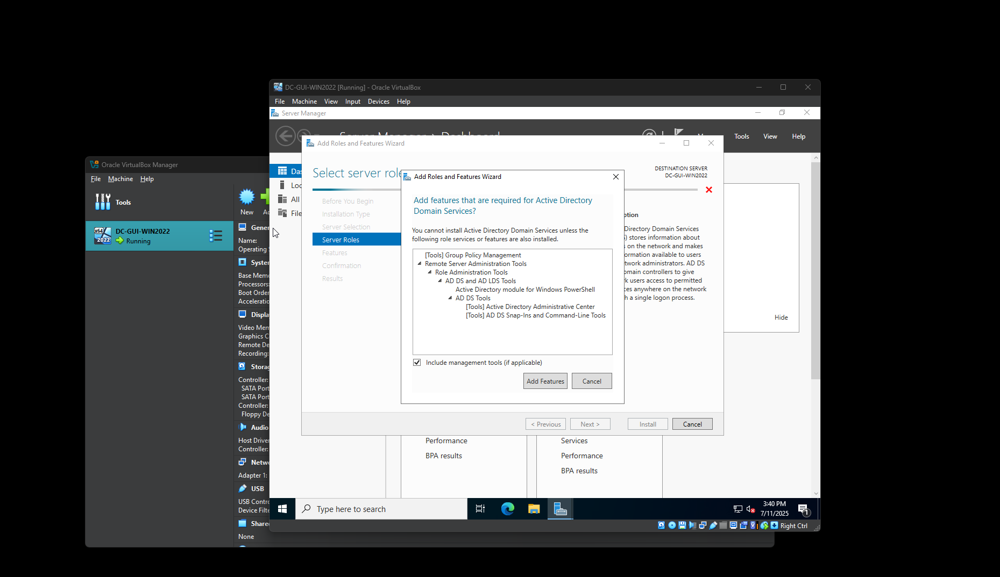

# Security+ Lab Project: Setting Up Active Directory & Password Policies

This project documents the process of setting up a Windows Server 2022 virtual machine as a domain controller, configuring Active Directory Domain Services (AD DS), and creating custom password policies using Group Policy Management.

---

### 🖼️ Screenshot 01 – Renaming the Computer


In this step, I renamed the default computer name (`DC-WINSERVER2022`) to `DC-CYBERLAB` as part of the post-installation configuration.

Renaming the server to something meaningful helps with identification — especially when managing multiple servers in a real-world domain environment. Using a prefix like `DC-` (Domain Controller) makes it clear that this server will be responsible for managing domain authentication and directory services.

📍 **Command-line Setup Tool:** This is part of the initial Windows Server Setup screen shown after installation, before the full GUI environment loads.

---

### 🖼️ Screenshot 02 – Initial Server Setup via SConfig


After the Windows Server 2022 installation completed, I was brought to the **SConfig** (Server Configuration) menu. This command-line utility allows you to configure key server settings before launching the desktop GUI.

From this screen, I verified:
- The computer name change (now shows as `DC-CYBERLAB`)
- That the system is in **Workgroup mode** (default before domain promotion)
- Remote management was enabled

🔧 Other available configuration options from this screen include:
- Setting a static IP address
- Enabling Remote Desktop
- Installing updates
- Joining a domain or changing to a new workgroup
- Accessing PowerShell to install additional features

This menu simulates how **real-world system administrators** often configure headless servers, especially in secure or remote environments where GUI access isn’t always available.

📝 **Tip:** You can type the number for any menu item to access its configuration screen. For example, typing `8` accesses **Network Settings**.

---

### 🖼️ Screenshot 03 – Viewing Network Adapter in SConfig


After selecting option `8` from the SConfig menu, I was shown a list of available network adapters. This screen confirms which network interfaces are installed and currently active.

In this case:
- **Index #**: 1
- **IP Address**: 10.0.2.15 (assigned via DHCP)
- **Adapter**: Intel(R) PRO/1000 MT Desktop Adapter (default VirtualBox NIC)

📌 This screen is important because it allows you to:
- Select which adapter to configure
- Set a **static IP** (important for domain controllers)
- Configure **DNS** settings

🔧 To proceed, you type the **index number** for the adapter you want to configure — in my case, `1`.

---

### 🖼️ Screenshot 04 – Set Static IP and DNS Server (Before Promotion)


Once I selected my network adapter (`Index 1`), I was given the following options:

1. Set network adapter address  
2. Set DNS servers  
3. Clear DNS server settings  

✅ As a best practice for domain controllers and any critical infrastructure, **a static IP address is required**. DHCP-assigned addresses can change over time, which would break name resolution and trust relationships in the domain.

---

#### Why this matters in the real world:
- **Static IP** ensures stability for domain services, DNS, and GPO distribution  
- Helps other devices on the network consistently reach this server  
- Prepares the server for **Active Directory promotion**

🛠️ **What I did next:**
- Selected option `1` to begin configuring the static IP, subnet mask, and default gateway.  
- I then continued with option `2` to specify a preferred DNS server.

---

### 🖼️ Screenshot 05 – Enabling Remote Desktop Access


Next, I selected option `7` from the SConfig main menu to configure **Remote Desktop**.

This feature allows administrators to manage the server remotely using a Remote Desktop Protocol (RDP) client — especially helpful in enterprise environments or cloud-based deployments where direct console access is limited.

I was prompted with the following choices:

1. **Allow only clients using Network Level Authentication (NLA)** – more secure  
2. **Allow any version of Remote Desktop** – less secure, allows legacy connections  

✅ I selected **Option 1** to enforce **Network Level Authentication (NLA)** for improved security. This ensures that only authenticated users from trusted machines can initiate remote sessions.

---

#### 🛡️ Why this matters in the real world:
- **Remote Desktop (RDP)** is essential for remote server management — especially in hybrid or multi-site IT setups  
- Enabling NLA reduces the risk of brute-force RDP attacks  
- This setting is often required when managing servers via **Azure**, **Hyper-V**, or **Remote Management Tools** like RSAT or Windows Admin Center

---

### 🖼️ Screenshot 06 – Selecting Allowed Remote Desktop Clients


After choosing to enable Remote Desktop, I was prompted to choose which types of client connections should be allowed:

1. **Allow only clients running Remote Desktop with Network Level Authentication (more secure)**  
2. **Allow clients running any version of Remote Desktop (less secure)**  

✅ I selected **Option 1** – this enforces **Network Level Authentication (NLA)**.

---

### 🖼️ Screenshot 07 – Attempting to Launch GUI with `explorer.exe`


At this point, I attempted to launch the Windows desktop environment using the `explorer` command from the PowerShell/Command Prompt, but received the following error:

> "The term 'explorer' is not recognized as the name of a cmdlet, function, script file, or operable program..."

This happened because I accidentally installed **Windows Server 2022 without Desktop Experience (Server Core)**. In this configuration, the GUI components are not installed, and the server must be managed entirely from PowerShell or remotely.

---

### 🔁 What I Did Next:

I reinstalled the OS, this time choosing:
- **Windows Server 2022 Standard Evaluation – Desktop Experience**

This enabled the full GUI, including Server Manager, Active Directory tools, and graphical Group Policy editors.

---

### 💡 Why This Is Valuable:

- Many production servers **run Server Core** for performance and security reasons  
- Learning to identify and recover from setup mistakes is a key IT skill  
- This shows the ability to **troubleshoot**, **adapt**, and **correct configuration issues** on your own

📝 I included this step in the project to demonstrate the learning process and the importance of selecting the correct edition during setup.

---

### 🖼️ Screenshot 08 – First Login into the Windows Server 2022 GUI


After reinstalling the operating system and choosing the **Desktop Experience** edition, I successfully booted into the full graphical user interface (GUI) of Windows Server 2022.

The screen shows the default landing page: **Server Manager – Dashboard**, which is where most core configuration tasks begin.

---

### 🧠 Why This Matters:

- Many Windows Server roles (like **Active Directory**, **DNS**, **DHCP**, and **GPO**) are most easily managed through the GUI  
- While headless (CLI-only) setup is powerful, the GUI is commonly used in real-world small/medium-sized business environments  
- This environment mirrors what a help desk or junior sysadmin would see when logging into a real production server

🔧 From here, I would continue the setup by:
- Adding Active Directory Domain Services (AD DS)  
- Promoting the server to a domain controller  
- Managing password policies using Group Policy Management

---

📝 Pro Tip:
If you're running a server in a VM and performance is low, disable **Server Manager’s auto-start** on login using the “Manage” menu → **Server Manager Properties** → Check “Do not start Server Manager automatically at logon”.

---

### 🖼️ Screenshot 09 – Selecting Role-Based or Feature-Based Installation


In Server Manager, I clicked **"Add roles and features"** to begin setting up Active Directory Domain Services (AD DS). This opened the **Add Roles and Features Wizard**.

On this screen, I selected:
> ✅ **Role-based or feature-based installation**

This is the most common option and is used to install server roles (like AD DS, DNS, DHCP, etc.) and features on a **single, physical or virtual server**.

---

### 🧠 Why This Step Matters:

- This is the standard method to **enable server roles** on Windows Server  
- It's a common real-world task for help desk and system administrators  
- Knowing how to use the wizard properly is a fundamental server management skill

🔐 For this lab, we are preparing the server to become a **Domain Controller**, which will allow centralized user, computer, and security policy management — just like in corporate networks.

---

📝 **Next Steps in the Wizard:**
- Select the local server as the installation target  
- Choose the role: **Active Directory Domain Services**  
- Accept dependencies and proceed through configuration

---

### 🖼️ Screenshot 10 – Selecting the Active Directory Domain Services (AD DS) Role


On the **Select server roles** screen, I hovered over and selected:
> ✅ **Active Directory Domain Services**

This is the core role that turns a Windows Server into a **domain controller** — the heart of a Windows-based enterprise network.

After selecting the role, the wizard automatically prompted me to install **dependent features** (like management tools and MMC snap-ins), which I accepted.

---

### 🧠 Why This Role Matters:

- **AD DS** provides centralized management of users, computers, groups, and security policies across the network  
- Enables the creation of a domain (`yourname.local`) where devices can **join**, **authenticate**, and be managed  
- Used daily in almost every mid-to-large IT organization for **identity and access control**

---

🔐 Real-World Use Case:
> A company with 100+ employees would use a domain controller to manage:  
> - Employee logins  
> - Password complexity enforcement  
> - Software deployment via GPO  
> - Security auditing

🛠️ After this step, I continued through the wizard to confirm features, and eventually promoted the server to a domain controller.

---

### 🖼️ Screenshot 11 – Adding Required Features for AD DS



After selecting the **Active Directory Domain Services (AD DS)** role, the wizard prompted me with a pop-up to install required supporting features.

I clicked:
> ✅ **Add Features**

This ensures that tools like **AD DS Management Console**, **PowerShell modules**, and **Graphical MMC Snap-ins** are installed — all of which are necessary for managing Active Directory users, domains, and policies.

---

### 🧠 Why This Step Is Important:

- These features are **not optional** if you want to actually manage the domain after installation  
- Includes tools like:  
  - **Active Directory Users and Computers (ADUC)**  
  - **Active Directory Administrative Center (ADAC)**  
  - **Group Policy Management Console (GPMC)**  
- Allows both **local and remote** administration of the domain

---

🛠️ Pro Tip for New Admins:
In enterprise environments, you may need to install these tools **remotely** using PowerShell with `Add-WindowsFeature`, or deploy them through **Windows Admin Center**. Knowing how to install and recognize dependencies shows you're thinking like a real sysadmin.

---

### 🖼️ Screenshot 12 – Confirming Role and Feature Installation Selections


At this point, I reviewed all of my configuration choices before starting the installation process. This screen summarizes:

- **Installation type:** Role-based  
- **Target server:** DC-CYBERLAB  
- **Role to install:** Active Directory Domain Services (AD DS)  
- **Dependent features:** Group Policy Management, Remote Server Administration Tools (RSAT), and AD DS snap-ins

After confirming that all settings were correct, I clicked:
> ✅ **Install**

---

### 🧠 Why This Step Matters:

- It teaches **change control discipline** — the habit of verifying everything before making system changes  
- Mistakes (like forgetting a needed role or installing on the wrong server) are **caught here before damage is done**  
- In production, changes like this are logged, reviewed, and often require peer approval — showing this step reflects a real-world mindset

---

📝 Pro Tip for Beginners:
If you're deploying in a real environment:  
- Take a screenshot of this confirmation page before clicking install (for documentation or rollback logs)  
- Optionally check the box for **“Restart the destination server automatically if required”** if you’ve confirmed with your team or documentation

---

### 🖼️ Screenshot 13 – Promoting the Server to a Domain Controller


After installing the Active Directory Domain Services (AD DS) role, a yellow notification banner appeared in **Server Manager** with the message:

> “Additional steps are required to make this machine a domain controller.”

I clicked:
> ✅ **Promote this server to a domain controller**

This launched the **Active Directory Domain Services Configuration Wizard**, where I will:
- Create a **new forest and domain** (since this is my first domain controller)  
- Set the **domain name**  
- Configure the **Directory Services Restore Mode (DSRM)** password

---

### 🧠 Why This Step Matters:

- Promoting a server to a domain controller creates the **first domain in a new forest**, which is the top-level structure of Active Directory  
- This step **installs and configures the AD database (NTDS)**, **creates SYSVOL**, and sets up **replication** (if more domain controllers are added later)  
- This is a **core responsibility** for help desk, sysadmin, and even cybersecurity roles — understanding how identity infrastructure is built

---

🔐 Real-World Application:
> In a production environment, this task would usually be performed during:  
> - New office/domain setup  
> - Disaster recovery (replacing a failed DC)  
> - Lab environments for cybersecurity testing or compliance auditing

---

### 🖼️ Screenshot 14 – Creating a New Forest in Active Directory

In the **Active Directory Domain Services Configuration Wizard**, I selected:

> ✅ **Add a new forest**

This option is used when you are creating the **very first domain** in a new network environment. In my case, this is for a standalone lab setup, but the same process applies in real production environments.

I then entered my root domain name:  
> 🔤 **cyberlab.local**

This will become the top-level domain for all users, computers, and group policies in my Active Directory environment.


---

### 🧠 Why This Step Matters:

- A **forest** is the top-level container in Active Directory — it can hold one or more **domains**  
- Creating a new forest means you're building a **completely new identity infrastructure** from scratch  
- Every device or user that joins this domain will use **cyberlab.local** as their domain suffix (e.g., `user@cyberlab.local`)

---

💡 Real-World Example:  
> A company like “Acme Inc.” may create a forest with the domain **acme.local** or **corp.acme.com** during its initial IT setup. Domain controllers, DNS, and Group Policy will all be based around this root domain name.

📝 Pro Tip:  
- Domain names for internal use often end in `.local` or use a subdomain like `corp.company.com`  
- Avoid using actual public domains like `company.com` unless you're integrating with public-facing systems
  
---

### 🖼️ Screenshot 15 – Reviewing AD DS Configuration Settings

This screen presents a final summary of all the choices made during the Active Directory Domain Services configuration process. It includes:

- **Deployment operation:** Add a new forest  
- **Root domain name:** cyberlab.local  
- **Forest and domain functional levels:** Windows Server 2022  
- **Domain Controller capabilities:** DNS, Global Catalog  
- **Directory Services Restore Mode (DSRM) password:** (not displayed for security)

After reviewing all settings and confirming accuracy, I clicked:  
> ✅ **Next**


---

### 🧠 Why This Step Matters:

- Reinforces the habit of **careful review before applying critical system changes**
- Prevents misconfigurations that would require **a full demotion/reinstallation**
- Confirms details like functional level and domain name spelling — which can’t be easily changed after deployment

---

📝 Pro Tip:
- In enterprise environments, this screen is often **captured in change documentation** or attached to approval tickets
- If something looks wrong here, **stop and go back** — it’s faster than repairing a broken domain setup later

---

### 🖼️ Screenshot 16 – Prerequisites Check for Domain Controller Configuration

Before promoting the server to a domain controller, the wizard performs a **prerequisite check** to ensure the system is properly configured.

This step automatically verifies:
- Network configuration
- Domain name formatting
- DNS delegation (optional warning)
- Required ports and services
- Existing domain conflicts

In my case, the check completed successfully with a few warnings (e.g., DNS delegation), which are normal in a lab setup.

Once I reviewed the results, I clicked:  
> ✅ **Install**


---

### 🧠 Why This Step Matters:

- Ensures your domain controller won’t break due to missing configs or bad networking
- Catches problems like:
  - Incorrect DNS setup
  - Invalid domain names
  - Missing role features

---

🛠️ Pro Tip:
- **Warnings ≠ errors** — for example, a “DNS delegation” warning is common in standalone labs and can be safely ignored  
- In real-world setups, use this screen to capture evidence for **audits or deployment checklists**


---

### 🖼️ Screenshot 17 – Accessing Server Tools After AD DS Installation

After the server rebooted and completed the promotion to domain controller, I returned to **Server Manager** and clicked the **Tools** menu in the top-right corner.

This menu now includes important Active Directory management tools such as:
- **Active Directory Users and Computers (ADUC)**
- **Active Directory Domains and Trusts**
- **Active Directory Sites and Services**
- **Group Policy Management**

These tools are only available **after the AD DS role has been installed and configured**.


---

### 🧠 Why This Step Matters:

- Confirms the **AD DS role was successfully installed and configured**
- Gives access to essential tools used daily in Active Directory environments
- Shows you’re ready to start **creating users, groups, and applying Group Policy**

---

📝 Pro Tip:
- If these tools don’t appear, open **PowerShell as admin** and run:  
  ```powershell
  Get-WindowsFeature RSAT*

---

### 🖼️ Screenshot 18 – DNS Manager: Viewing Forward Lookup Zones

Now that the server is a domain controller, it automatically acts as a **DNS server**. I opened **DNS Manager** from the Tools menu and navigated to:

> 📁 **Forward Lookup Zones** ➝ `cyberlab.local`

This zone stores all the DNS records related to my new domain, such as:
- Host (A) records for the domain controller
- SRV records used by Active Directory
- NS and SOA records that define authority


---

### 🧠 Why This Step Matters:

- Active Directory **relies heavily on DNS** to locate domain controllers, services, and other devices  
- A healthy Forward Lookup Zone is required for **domain join operations, authentication, and Group Policy application**
- Knowing how to review and troubleshoot DNS zones is a **must-have skill** for any sysadmin or cybersecurity analyst

---

📝 Pro Tip:
- If clients can’t join the domain or apply GPOs, always check that the **SRV records** exist in the `_msdcs` subfolder  
- You can also test resolution using:  
  ```powershell
  nslookup domaincontroller.cyberlab.local

---

### 🖼️ Screenshot 19 – Navigating to Password Policy in Group Policy Management Editor

In this step, I opened the **Group Policy Management Editor** and navigated to the location where password policies are defined:

> 📂 **Computer Configuration** ➝ **Policies** ➝ **Windows Settings** ➝ **Security Settings** ➝ **Account Policies** ➝ **Password Policy**

This is where administrators configure domain-wide settings like:
- Minimum password length
- Maximum password age
- Password complexity requirements


---

### 🧠 Why This Step Matters:

- **Password policies** are a critical part of any organization's security posture  
- These settings apply to **all domain-joined machines**, ensuring consistent enforcement of security standards  
- Misconfiguring this can lead to **weakened defenses** or even **domain lockouts** in real-world scenarios

---

🔐 Real-World Example:
> Companies often require:
> - Minimum 12–16 characters  
> - Complexity enabled (upper/lowercase, numbers, symbols)  
> - Password history and lockout policies  
> These are typically aligned with frameworks like **NIST**, **CMMC**, or **CIS Benchmarks**.

🛠️ Pro Tip:
- Changes to password policy **must be made in the Default Domain Policy GPO** to apply across the entire domain  
- You can enforce these settings immediately using:  
  ```powershell
  gpupdate /force

---

### 🖼️ Screenshot 20 – Creating a New Group Policy Object (GPO)

While in the **Group Policy Management Console**, I navigated to:

> 🌐 **cyberlab.local** ➝ **Group Policy Objects**  
> 🖱️ Right-clicked **Group Policy Objects** ➝ Clicked **New**

This allows me to create a **new, custom GPO** that can later be linked to a specific domain, site, or organizational unit (OU). Custom GPOs are useful when you want to separate policies by function (e.g., password policies, software restrictions, drive mappings).


---

### 🧠 Why This Step Matters:

- Helps organize Group Policies into logical, manageable components  
- Prevents editing the **Default Domain Policy** directly, which is risky in enterprise environments  
- Encourages **modular design** — easier to audit, troubleshoot, and delegate control

---

📝 Pro Tip:
- Always **name GPOs clearly**, e.g., `GPO-PasswordPolicy-Secure` or `GPO-DriveMappings-Marketing`
- After creating the GPO, you'll need to **link it** to a domain or OU for it to take effect

---

### 🖼️ Screenshot 21 – Naming the New Group Policy Object

After selecting **New** in the Group Policy Objects section, a pop-up appeared prompting me to name the new GPO.

I named it:  
> 🏷️ **Custom Password Policy**

This name clearly identifies the purpose of the policy, helping with organization and troubleshooting in the future.


---

### 🧠 Why This Step Matters:

- Using clear, descriptive names for GPOs helps with **administration, delegation, and audits**
- Naming conventions allow teams to quickly understand a policy's purpose without opening it
- In enterprise environments, poor naming leads to **confusion, duplicated settings, or accidental overrides**

---

📝 Pro Tip:
- Use a naming format like `GPO-[Purpose]-[Scope/OU]` for clarity — e.g., `GPO-PasswordPolicy-Domain`, `GPO-LockScreen-FinanceOU`
- Avoid naming GPOs things like "New Policy 1" — it creates headaches later on

---

### 🖼️ Screenshot 22 – Verifying Default Domain Policy Link Status

While still in **Group Policy Management**, I reviewed the list of Group Policy Objects under the **cyberlab.local** domain.

I observed that the **Default Domain Policy** has:
> ✅ **Link Enabled: Yes**

This confirms that the Default Domain Policy is actively applied to all domain-joined machines.


---

### 🧠 Why This Step Matters:

- The Default Domain Policy is where **domain-wide settings** (like password policies, account lockouts, Kerberos settings) are usually configured  
- If the link were disabled, **critical security settings might not be enforced**, even if they were configured correctly in the GPO  
- This step is part of **verifying GPO health and linkage** — a must-know for entry-level sysadmins and cybersecurity analysts

---

🛠️ Pro Tip:
- You can disable a GPO link to temporarily stop applying it *without deleting the GPO itself* — useful for testing or troubleshooting  
- Use the **"Group Policy Results Wizard"** to simulate and verify which policies are applied to a user or computer

---

### 🖼️ Screenshot 23 – Editing Maximum Password Age in Custom GPO

I opened the **Custom Password Policy** GPO for editing and navigated to:

> 📂 **Computer Configuration** ➝ **Policies** ➝ **Windows Settings** ➝ **Security Settings** ➝ **Account Policies** ➝ **Password Policy**

From there, I modified the **Maximum password age** setting to:  
> 📆 **60 days**

This means users will be required to change their passwords every 60 days to maintain compliance with security standards.


---

### 🧠 Why This Step Matters:

- Enforcing a **maximum password age** ensures that compromised or weak passwords don’t persist indefinitely  
- This setting is a **core part of many compliance frameworks** like NIST, CMMC, and CIS  
- It's one of several policy controls used to enforce **secure password hygiene** across the domain

---

📝 Pro Tip:
- For stronger security, combine this with:
  - **Minimum password length**
  - **Password complexity requirements**
  - **Password history enforcement**
- Avoid setting the age too short (e.g., 7 or 14 days) — this frustrates users and can lead to insecure behavior like writing passwords down

---

### 🖼️ Screenshot 24 – Setting Minimum Password Length in Custom GPO

Continuing in the **Custom Password Policy** GPO editor, I adjusted the:

> 🔢 **Minimum password length**

to:  
> 🔒 **12 characters**

This setting enforces that all user passwords must be at least 12 characters long, increasing password strength and resistance to brute-force attacks.


---

### 🧠 Why This Step Matters:

- Longer passwords are significantly harder to guess or crack  
- Many cybersecurity standards recommend a minimum of 12+ characters for strong security  
- This complements other password policies like complexity and expiration to create a layered defense

---

🛠️ Pro Tip:
- Encourage passphrases or combinations of words for better memorability and security  
- Avoid setting the minimum length too low (like 6 or 8), as these are vulnerable to attack

---

### 🖼️ Screenshot 25 – Linking an Existing GPO to the Domain

In the **Group Policy Management Console**, I navigated to my domain (`cyberlab.local`), right-clicked it, and selected:

> 🔗 **Link an Existing GPO**

This allows me to apply a previously created Group Policy Object (such as the **Custom Password Policy**) to the entire domain or specific organizational units (OUs).


---

### 🧠 Why This Step Matters:

- Linking a GPO is how policies actually get applied to users and computers within the domain  
- You can link the same GPO to multiple domains, sites, or OUs for flexible policy management  
- This is a fundamental step in deploying your configured settings across your Active Directory environment

---

📝 Pro Tip:
- Always double-check which GPOs are linked to your domain and OUs to avoid conflicting policies  
- Use **Group Policy Modeling** to simulate how linked GPOs will affect specific users or computers before applying changes

---

### 🖼️ Screenshot 26 – Selecting the Custom Password Policy GPO to Link

In the **Link GPO** window, I selected the previously created:

> 🏷️ **Custom Password Policy**

This action attaches the custom policy to the domain, enabling its settings to be applied across all domain-joined devices.


---

### 🧠 Why This Step Matters:

- Ensures the **customized password rules** are enforced domain-wide  
- Enables granular policy management separate from the Default Domain Policy  
- Facilitates easier updates and troubleshooting by isolating settings within dedicated GPOs

---

🛠️ Pro Tip:
- After linking, confirm the GPO is listed under linked Group Policy Objects for your domain  
- Use `gpupdate /force` on client machines to immediately apply new policies

---

### 🧠 Why This Step Matters:

- Validates that password policies are enforced at the user creation level  
- Prevents weak or non-compliant passwords from being accepted

---

### 🖼️ Screenshot 27 – Adding a New User in Active Directory Users and Computers

In **Active Directory Users and Computers (ADUC)**, I navigated to the **Users** container within the `cyberlab.local` domain.

I right-clicked **Users**, selected **New** ➝ **User**, and began creating a new user account named:

> 👤 **Luz Cortez**

This user will be part of the domain and can be assigned permissions, group memberships, and policies.


---

### 🧠 Why This Step Matters:

- Creating user accounts is a foundational task in Active Directory management  
- Users must exist in the directory to authenticate and access domain resources  
- Proper user setup allows assignment of roles, security groups, and policy enforcement

---

🛠️ Pro Tip:
- Use meaningful usernames and consistent naming conventions for ease of administration  
- Always set strong initial passwords and consider enabling **password change at next logon**

---

### 🖼️ Screenshot 28 – Setting a Password That Does Not Meet Policy Requirements

While creating the user **Luz Cortez** in **Active Directory Users and Computers**, I reached the password setup screen.

I attempted to assign the password:  
> 🔑 **granitebox**

This password **does not meet the custom password policy requirements** (e.g., minimum length, complexity) that we set earlier.


---

### 🧠 Why This Step Matters:

- Demonstrates that **Active Directory enforces password policies in real time**  
- Helps prevent users from choosing weak or non-compliant passwords  
- This validation reduces the risk of compromised accounts and strengthens overall security posture

---

🛠️ Pro Tip:
- If the password is rejected, educate users on the password complexity requirements to encourage stronger credentials  
- Consider implementing **password complexity notification messages** in your user onboarding process

---

### 🖼️ Screenshot 29 – Password Rejection Popup Due to Policy Violation

After entering the password **granitebox** for user **Luz Cortez**, Active Directory immediately displayed an error popup stating that the password does not meet the domain’s password policy requirements.

This enforcement helps ensure all passwords comply with security standards.


---

### 🧠 Why This Step Matters:

- Shows the **built-in enforcement of password complexity and length policies** in Active Directory  
- Prevents weak passwords that can be easily guessed or cracked  
- Acts as an immediate feedback mechanism for users and administrators alike

---

🛠️ Pro Tip:
- Customize password policy messages where possible to provide clearer guidance  
- Use this enforcement step as part of **security awareness training** for new users

---

### 🖼️ Screenshot 30 – Successful Password Set and New User Created

After the initial password was rejected, I entered a compliant password for user **Luz Cortez**:

> 🔐 **U5ERp@ssword2025**

This password meets the custom password policy requirements, and the user account was successfully created.

Now, **Luz Cortez** appears listed under the **Users** container in the `cyberlab.local` domain within **Active Directory Users and Computers**.


---

### 🧠 Why This Step Matters:

- Confirms that password policies are effectively enforced without blocking valid credentials  
- Shows the successful creation of a domain user who can now authenticate and access resources  
- Illustrates the typical user onboarding process in Active Directory environments

---

📝 Pro Tip:
- Remind users to change their password at first logon for better security hygiene  
- Consider adding new users to relevant security or distribution groups immediately after creation
